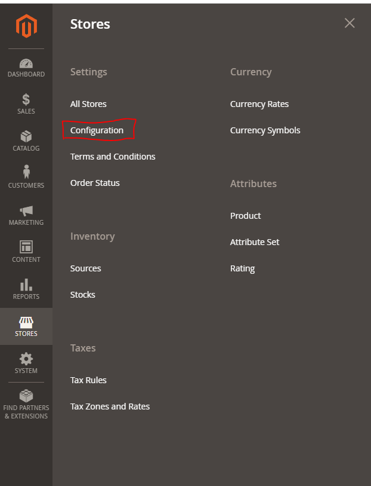
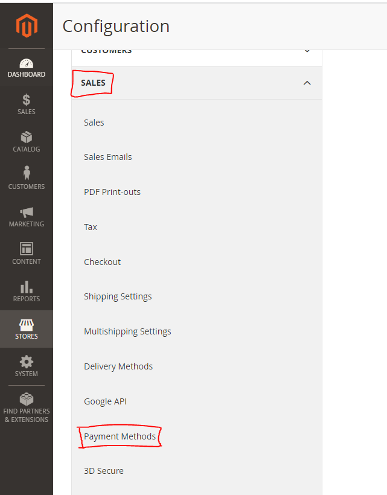
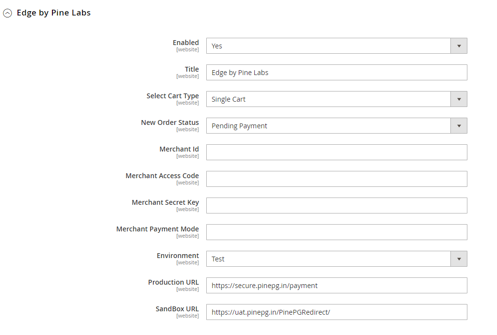
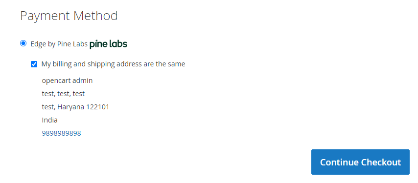
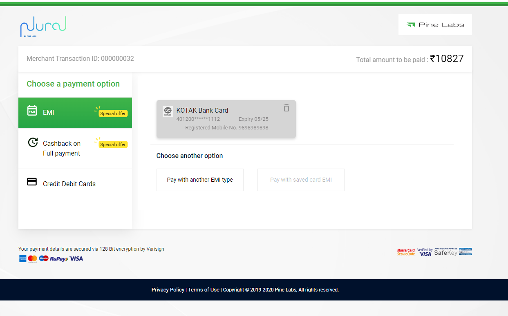
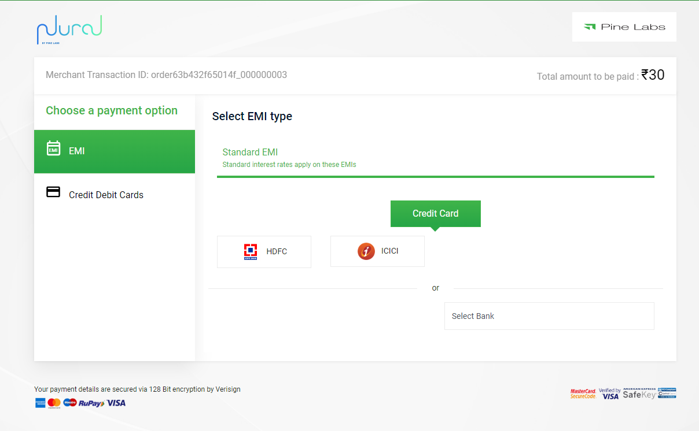
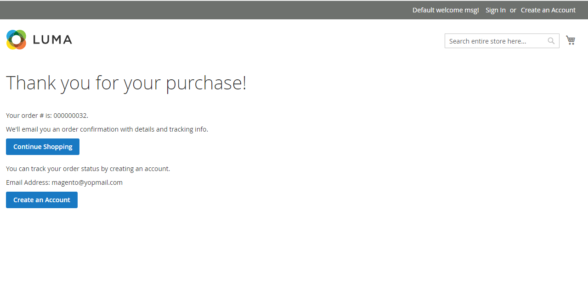

**INTEGRATION DOCUMENT**

**Magneto 2.4.2v**

**Introduction**

This guide will show you how to Install and configure the PinePG Edge
Extension for Magento on your Magento-powered website for payments
through Credit Card, Debit Card, and EMI. The plugin supports Payment
through the PinePG Edge platform.

**Steps to Integrate**

1.  First, download the extension files from the download link. This
    > will typically be in the form of a zip file.

2.  Once you have downloaded the extension files, unzip them and move
    > them to the **app/code** directory in your Magento installation.
    > This is where all of your custom code and extensions will be
    > stored.

**Note:** Please create a **code** folder under **\<root\>/app** if it
doesn't already exist.

3.  Next, open a terminal and navigate to the root directory of your
    > Magento installation. This is where the bin directory is located,
    > which contains the command-line tools for managing your Magento
    > installation.

4.  Once you are in the root directory, run the following commands to
    > enable the extension:

**Step 1:** php bin/magento module:enable Pinelabs_PinePGGateway

**Step 2:** php bin/magento setup:upgrade

**Step 3:** php bin/magento setup:static-content:deploy

**Step 4:** php bin/magento cache:clean

These commands will enable the extension and make it available for use
in your Magento installation.

5.  After running these commands

**Step 1**: Log in to the Magento backend and go to **Stores** \>
**Configuration**:

**Step 2:** Then Click on Configuration, on the next window go to
**Sales** \> **Payment Methods**:

This is where you will find a list of all available payment methods in
your Magento installation. 

6.  In this list, you should see the payment method provided by the
    > extension you installed. If it is listed there, then the extension
    > has been installed successfully and is ready for use.

> 

In this extension fill up the required fields like Merchant Key, Access
Code, Merchant secret, etc.

**6.1** Enable: 'Yes' to enable the module.

**6.2** Title: Name to be shown on the checkout page

**6.3** Select Cart Type: This option has a Single and Multi-Cart
option. If you have credentials for a single cart, then select the
Single Cart option. If you have credentials for a multi-cart, then
select the Multi-Cart option.

**6.4** Merchant Id: add the Id as per the selected Payment Environment
(Test / Live)

**6.5** Merchant Access Code: add the Access Code as per the selected
Payment Environment (Test / Live)

**6.6** Merchant Secret: add the Merchant Secret as per the selected
Payment Environment (Test / Live)

**6.7** Merchant Payment Mode: Add a mode that is enabled for your
merchant

**6.8** Environment: Test for testing the payment gateway and select
Live for accepting the real payments.

7.   After successfully installing the extension, you can see the
    > Payment method of your extension on your Checkout Page.

8.  When you click on Place Order you will see the payment gateway
    > window where you must choose your payment options:

> In the case of a Special Offer
>
> 
>
> In the case of Standard EMI
>
>  

9.  After completing the payment successfully you will redirect to the
    > success page :

>  

10. If the payment is failed then the user can redirect to the failure
    > page.

**Note:**

Pine Plugins don't handle shipping or any additional charges so cart
value must be equivalent to Product value hence take the same
internally.

Please note no additional charges like TDR, GST, etc are handled in our
Plugins and the same need to be manually handled at the merchant end.
